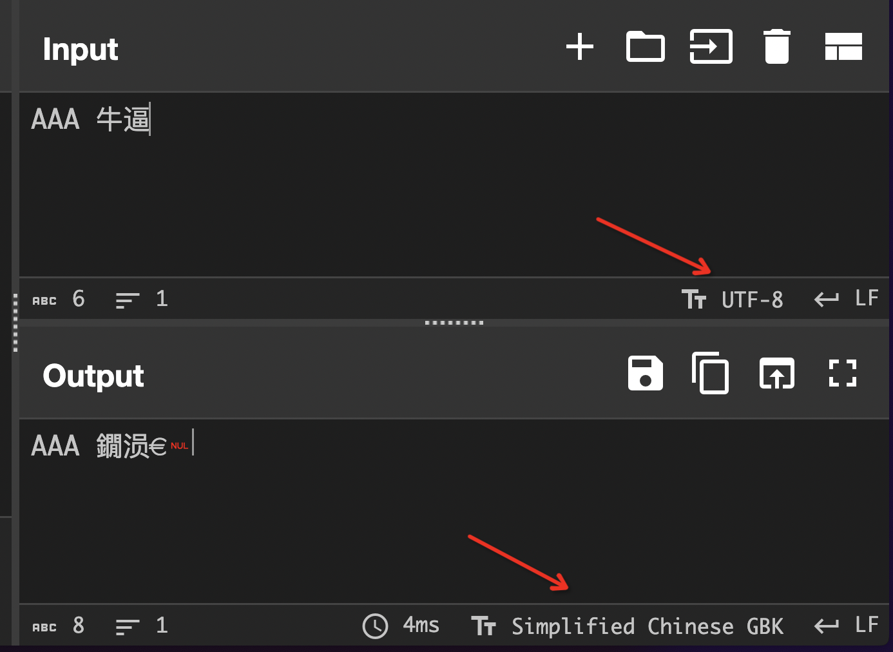

# Misc Lab 1：编解码及 OSINT

本节 Lab 由以下两部分组成：

- [Task 1: 乱码情形探究](#task-1)（二选一完成，40 分，多做无 bonus）
- 两道题目二选一完成（60 分，多做有 bonus，最多加 15 分）
    - [Challenge 1: GB 系列编码研究实战](#challenge-1)
    - [Challenge 2: OSINT 图片信息搜集实战](#challenge-2)

lab 分数分配与 bonus 政策以最终为准。

具体实验报告需要写的内容会在下面具体题目里面描述。对于题目有任何问题都可以在群里/私戳 Gooduck 提问。

本次 lab 的 ddl 在发布两周以后即 7 月 19 日晚 23:59，请注意安排时间。

## Task 1
### Background
我们课上介绍了字符编码的意义，并且较为详细的讲解了 ASCII、Latin-1 以及 Unicode 系列编码的原理。在这个任务中，你将需要自行探索了解各种情况乱码产生的原因，思考恢复乱码的可能性。

#### 乱码原因
课上我们讲过了，通过一种字符编码来解读另一种字符编码的字节流，就会导致解读出来的字符并非预期，从而产生所谓“乱码”。这里我们将探究一下具体的原因。

常见情况下有以下几种情形：

1. 用 GBK 解码 UTF-8 编码的文本
2. 用 UTF-8 解码 GBK 编码的文本
3. 用 latin-1 解码 UTF-8 编码的文本
4. 用 latin-1 解码 GBK 编码的文本
5. 先用 GBK 解码 UTF-8 编码的文本，再用 UTF-8 解码前面的结果
6. 先用 UTF-8 解码 GBK 编码的文本，再用 GBK 解码前面的结果

注意要想造成乱码，一定说明字符编码之间存在不兼容部分，因此这几种编码互相兼容的 ASCII 编码一定不会出现乱码，而中文文本则会出现乱码。

下面我会介绍几种研究乱码的方式，供大家参考。

##### vscode
创建一个文本文件，使用 vscode 打开，在右下角你会看到文件的编码方式（一般情况下默认为 UTF-8），说明此时文件存储的二进制为 UTF-8 编码的字节流。这时你可以点击这个位置，选择“通过编码重新打开（Reopen with Encoding）”，选择 GBK 编码，这样你所看见的就是将原有文件字节流通过 GBK 编码解析出来的字符（即前面说到的第 1 种情况），不出意外它应该是乱码。


或许你也会发现还有一个选项为“通过编码保存（Save with Encoding）”，它的作用就是将你现在看到的字符通过制定的编码方式重新编码为字节流，然后保存回文件中。比如继续上一步，我们看到了乱码，然后选择通过编码保存，选择 GBK，看起来没有任何事情发生。接下来再选择通过编码重新打开，选择 UTF-8，你或许会觉得此时恢复了正常，但有一些位置的字符变成了奇怪的符号，这种情况就是前面说到的第 5 中情况。

同理，你可以通过同样的方式研究其他四种乱码。

##### 观察十六进制
前面我们只看到了解码的结果，而没有看到文件存储字节流的内容。将字节流和解码得到的字符关联起来可以更好的理解乱码产生的原因。因此我们可以在 vscode 的基础上再使用十六进制编辑器来查看文件流的内容，进行比对。

##### CyberChef
我们课上提到了，CyberChef 的 Input 和 Output 窗格很清晰地增加了字符编码的选项，因此可以很方便地进行编码的转换。



但是 CyberChef 也存在一个问题，这个问题和处理 UTF-8 错误编码有关，感兴趣的同学可以自行探究一下具体是问题，以及为什么会出现这种问题。

##### python
利用 python 也可以进行编码的转换，这里是一些例子：

```python
In [1]: "测试".encode("UTF-8").decode("GBK") # 第一种情况的乱码
Out[1]: '娴嬭瘯'

In [2]: "测试".encode("UTF-8")  # 用 UTF-8 编码编码 “测试”
Out[2]: b'\xe6\xb5\x8b\xe8\xaf\x95'

In [3]: "娴嬭瘯".encode("GBK")  # 用 GBK 编码编码 “娴嬭瘯”
Out[3]: b'\xe6\xb5\x8b\xe8\xaf\x95'

In [4]: bin(0xe6), bin(0xb5), bin(0x8b) # 将十六进制转换为二进制
Out[4]: ('0b11100110', '0b10110101', '0b10001011')

In [5]: hex(0b0110_110101_001011)   # 手动解码 UTF-8 得到 Unicode 码位
Out[5]: '0x6d4b'

In [6]: "\u6d4b"    # 将 Unicode 码位转换为字符
Out[6]: '测'
```

#### UTF-8 解码错误
我们课上讲到了 Latin-1 编码可以解码任意字节流，但 UTF-8 不能，它的编码情况只有以下四种：

- **0**xxxxxxx
- **110**xxxxx **10**xxxxxx
- **1110**xxxx **10**xxxxxx **10**xxxxxx
- **11110**xxx **10**xxxxxx **10**xxxxxx **10**xxxxxx

所以如果一个字符开头就出现了 **10**xxxxxx 这样的字节，UTF-8 就不知道该怎么解码了。其他情况也会引起 UTF-8 解码错误。

Python 处理这种错误的默认方法是直接抛出 UnicodeDecodeError，大部分情况下是不方便的，所以一般情况的处理方式是针对错误的字节流进行替换，比如将错误的字节流替换为 U+FFFD（即 �），这也是一些古怪乱码的来源之一。

前面提到了 CyberChef 并没有采用这种处理方式，它将错误的字节也解码为了其他奇怪的字符，这可能导致“锟斤拷”乱码不会出现，请尝试使用其他方法进行 UTF-8 解码。

#### 乱码分析实战
ZJUCTF2023 的 "NATO26" 的题面是一串如下的乱码：
```plaintext
鍘熺悊绫讳技璐濇柉浜斿崄鍏﷿殑璐濇柉浜屽崄鍏﷿紪鐮佸叾鍐呭﷿涓哄枬褰╁０甯曞笗鍒╅┈榄佸寳鍏嬪洖闊虫煡鐞嗗潎鍖€甯曞笗鍥為煶绁栭瞾浜虹嫄姝ユ帰鎴堝﷿鎷夊潎鍖€鏈变附鍙舵湵涓藉彾榄佸寳鍏嬪痉灏斿﷿绁栭瞾浜哄▉澹﷿繉楂樺皵澶﷿悆楂樺皵澶﷿悆鍩冨厠鏂﷿皠绾垮枬褰╁０濂ユ柉鍗″焹鍏嬫柉灏勭嚎绁栭瞾浜洪害鍏嬪洖闊冲潎鍖€绁栭瞾浜哄﷿鎷夊痉灏斿﷿閰掑簵鑳滃埄鑰呴珮灏斿か鐞冨叕鏂よ儨鍒╄€呴害鍏嬪崄涓€鏈堝洖闊宠儨鍒╄€呭▉澹﷿繉濉炴媺鍏﷿枻寰峰皵濉斿叕鏂ゅ嵃搴︽煡鐞嗛害鍏嬮樋灏旀硶鍗板害鍧囧寑濂ユ柉鍗″枬褰╁０
```
这串乱码事实上出自于上面六种情况之中，你需要将其还原并根据得到的结果继续解码，最终得到 flag，并提交至[比赛平台](https://ctf.zjusec.com/games/3/challenges)检验正确性。标题中的 "NATO" 在课上也已经提到过。


### Task
你可以从以下两个任务 Task 1.1 和 Task 1.2 中选择一个完成，多做分数不溢出。

- Task 1.1
    1. 通过你喜欢的方式复现前面提到的六种乱码情况（每种 5 分，共 30 分）
    2. 回答以下问题：
       - 针对六种乱码情况，哪些是你觉得可以恢复的，哪些是不可以恢复的（5 分）
           - 这里我们默认解码之后同时用这种编码方式重新编码，并保存字节流到文件
       - 一个老生常谈的乱码“锟斤拷”，实验之后你应该了解了它到底是怎么产生的，请解释为什么会产生这个乱码，以及为什么是这三个特定的汉字（5 分） 
- Task 1.2
    - 完成 ZJUCTF2023 的 NATO26，写出你的解题思路，并提交 flag 进行验证（40 分）

## Challenge 1
### Background
#### GB 系列编码
这部分留给大家自行查阅资料了解。你需要知道的是 GB 2312、GBK、GB 18030 规定了三个不同大小的字符集，以及针对每个字符的编码。且 GB 18030 兼容 GBK 兼容 GB 2312 兼容 ASCII。更多细节可以自行查阅标准文件、介绍博客等。

### Task
1. 自行研究 GB 系列编码后，请简要说明三种字符编码的编码方式，并阐述 GB 系列是如何实现三个版本兼容的（20 分）
2. 完成了 GB 编码后，你需要在比赛平台上完成题目“字”，写出你的解题思路，并提交 flag 以验证正确性（40 分）
    - 这道题目改编自 AluyunCTF2024 的“字”，题目具有一定脑洞
    - 你需要从给出的这段文字中找出隐藏信息，**这段文字中最多可以隐藏 374 个比特的信息**
    - 你可能需要关注文段中的以下汉字：`一二人入八几力十又口土士大子小山工手文方无日月木止比毛氏水玄玉生用目石示立竹老而自至色行言赤足身酉里金隶青非面革音骨鬲`
    - 如果你得到了一串二进制信息但没什么头绪，可以试试按哪种长度分割时可以得到一些更相似的形式

## Challenge 2
选做此题目需要同时完成以下两个任务。

### Task 1: 45gfg9's easy OSINT（20 分）
这是 45gfg9 在韩国拍的一张照片（请下载图片后做题）：


请你回答以下两个问题：

1. 拍摄这张图片时所在位置？（在地图上指出）
2. 图片中的绿色路牌被遮挡住的右半边的内容是？（只需给出英文即可）

请将你的答案以及解题思路写在实验报告中。

### Task 2: pumpk1n's real OSINT（40 分）
这是 pumpk1n 在参加了一场线下 CTF 决赛后，回杭州时在飞机上拍的一张照片（请下载图片后做题）：


请给出以下几个问题的答案：

1. pumpk1n 参加的 CTF 比赛名称
2. 他所乘坐飞机的航班号
3. 飞机大致的起飞与落地时间
4. 图中出现了一个江中岛，在地图上指出这个岛的位置

请将你的答案以及解题思路写在实验报告中。如果答案中有不确定的地方，可以给出你的多种猜测。

以上的所有题目如果无法完整完成，也请将你的尝试写在报告中，我们会根据完成情况给部分分。