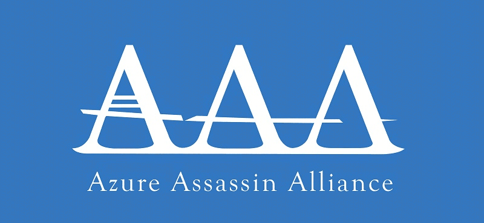

# Misc 基础 Lab 2：图片、音频隐写

本节 Lab 由以下两部分组成：

- 基础部分，必做（每题 20 分，共 60 分）
    - [Challenge 1: songmingti](#challenge-1)
    - [Challenge 2: miaomiaomiao](#challenge-2)
    - [Challenge 3: easy LSB](#challenge-3)
- 选做部分，分数见下，整体多出 100 分的为 bonus
    - [Challenge 4: Palette Stego](#challenge-5)（20 分）
    - [Challenge 5: Spectrogram](#challenge-6)（30 分）
    - [Challenge 6: Huffman Tree](#challenge-4)（50 分）

（最终的分数分配可能会根据大家的提交情况有所调整）

具体实验报告需要写的内容会在下面具体题目里面描述。对于题目有任何问题都可以在群里/私戳 TonyCrane 提问。

本次 lab 的 ddl 在发布两周以后即 7 月 26 日晚 23:59，请注意安排时间。

本次 lab 的安排是 60 分简单、基础的图片隐写题目。选做部分是一些在真实 CTF 比赛中完全可能出现的难度的题目，但在给了 hint 之后难度应该已经大大减小。鉴于本次实验可能难度过高，下一节关于取证的 lab 难度则都会比较简单。以及在做题过程中遇到任何问题，都请及时联系我，对于共性问题我会考虑继续放出 hint。

### Background
我们上课讲了很多种图片隐写的方式，总结起来，遇到简单图片隐写的题目，主要有以下尝试步骤一把梭：

- 使用 exiftool 检查图片元信息，看看有没有看起来会有用的信息
- 使用十六进制编辑器打开，观察文件中有无附带信息、图片基本格式是否正确
- 使用 binwalk 检查文件末尾是否叠加了多余的文件
- 使用 stegsolve 打开图片/或者使用 CyberChef
    - 观察各个通道的 bit plane
    - 使用 Extract LSB 尝试提取数据格式的 LSB（或者使用 zsteg 猜测）
- 考虑能否查找原图，如果找到了尝试进行比较
- 考虑是否是使用工具进行的图片隐写，多尝试一些常见的工具
- ...

相信有了这些步骤，基础部分的三道题都是砍瓜切菜了。

## Challenge 1

第一道题目是校巴上的 songmingti，链接：[zjusec.com/challenges/28](https://zjusec.com/challenges/28)。

请完成题目，提交 flag 成功，并在实验报告中写出你的解题思路和具体过程。

## Challenge 2

第二道题目是校巴上的 miaomiaomiao，链接：[zjusec.com/challenges/29](https://zjusec.com/challenges/29)。

请完成题目，提交 flag 成功，并在实验报告中写出你的解题思路和具体过程。

## Challenge 3

这是一道 LSB 隐写的题目，但和 lab 0 的方式有那么一点不一样，相信你一定也可以轻松解出 flag。

- 题目附件：[chal.png](https://raw.githubusercontent.com/team-s2/summer_course_2023/master/src/misc/lab2/easy_lsb/chal.png)

请完成题目，拿到 flag，并在实验报告中写出你的解题思路和具体过程。

## Challenge 4: Palette Stego
### Background

我们课上讲了 PNG 格式有四个标准 chunk：IHDR、PLTE、IDAT、IEND，并且详细讲了其中三个，只有 PLTE 没有具体介绍。

实际上这个块的用途是，PNG 有一种颜色模式是调色板模式，这种情况下会使用 PLTE 块存储调色板，具体格式请大家自行了解，然后在 IDAT 中将记录的像素值从原来的每个像素三个字节 RGB 改为一个字节调色板索引。更详细的内容请大家自行搜索相关文章、博客了解。（如果懒得搜的话我这里提供一个标准：[Portable Network Graphics (PNG) Specification (Third Edition)](https://www.w3.org/TR/png-3/)）

我们课上提到过的一个名字——EZStego 隐写。这是一个针对 GIF 或者使用调色板模式的 PNG 的一种隐写方式。类似 JPEG，它利用人眼对于亮度更敏感的特性，将调色板的颜色按照亮度排序，这样相邻的两个颜色在使用时交换索引视觉差别也不大，用这个方式就可以进行隐写。你可以搜索 “EZStego 隐写” 关键词了解更详细的隐写方法（注意不是 zsteg，那是一个命令行工具）。

### Challenge
下图就是题目，它使用 EZStego 隐写隐藏了 flag：

- 题目附件：[chal.png](https://raw.githubusercontent.com/team-s2/summer_course_2023/master/src/misc/lab2/palette/chal.png)

请学习 PLTE chunk 的格式、EZStego 隐写的原理和具体步骤，完成题目，拿到 flag，并在实验报告中写出你的解题思路和具体过程（包括解题代码）。

如果无法解出题目，也请将你的尝试写在报告中（你已经学到的相关知识也可以写进去），我们会根据你的进度给部分分。

### Hint

以下是一些针对使用 python 处理这道题时可能会有用的 hint：

- 题目图片的 mode 已经不是 "RGB" 了，而是 "P"
- 你可以通过 `img = Image.open(...)` 正常打开题目图片
- 调色板内容可以通过 `img.palette` 访问（具体结构请自行探索）
- 我针对像素的处理是一行一行进行的
    - 需要注意 PIL 中图片结构是先列后行，即 (x, y) 表示第 x 列第 y 行
    - 处理时注意循环顺序

## Challenge 5: Spectrogram
### Challenge
这道题目是一个音频隐写的题目，我通过一个 python 程序将一小段歌曲转换为了频谱动图，相信你一定可以从这张动图中就复原出原曲的大致样子。

- 题目附件：[flag.gif](https://raw.githubusercontent.com/team-s2/summer_course_2023/master/src/misc/lab2/fourier/flag.gif)、[generate.py](https://raw.githubusercontent.com/team-s2/summer_course_2023/master/src/misc/lab2/fourier/generate.py)

请参考生成频谱图的代码，尝试恢复原音频。你需要回答出这首歌曲是什么，并将你的解题思路和具体过程写在实验报告中，将你恢复出的音频和使用的脚本通过压缩包的形式同时上传。

如果无法完整完成复原，也请将你的尝试写在报告中，我们会根据完成情况给部分分。

### Hint

这道题目其实考点更偏向于 python 的使用（笑），你可能需要：

- 掌握 numpy 矩阵数据的处理方式
    - 不熟悉的话建议配合文档/教程通过实践来学习
- 搜索并简单阅读 librosa 这个库的文档
- 如果你被脚本中嵌套的矩阵处理搞糊涂了，不妨自己用另一个音频文件跑一下 generate.py，你可以在中途输出任何你想要了解的中间结果

## Challenge 6: Huffman Tree
### Background

我们课上讲到了 JPEG 文件会使用 Huffman 编码，以及是一种称为“范式 Huffman 编码”的变形版。关于 Huffman 编码有关的数据存储在了 DHT 块中，其具体格式需要你来自行查阅资料了解。

- [JPEG 中的范式哈夫曼编码](https://zhuanlan.zhihu.com/p/72044095)
- [JPEG算法解密（四）](https://www.thecodeway.com/?p=522)

在 JPEG 编解码的过程中会使用到计算出来的 Huffman 编码，这些编码与 DHT 块有关。而在实际解码的过程中，即使有编码没有被使用到，也不会认为出错了。所以出题人可以在 Huffman 编码树上插入实际没有用的编码，从而隐藏信息。

为了解决这样的题目，显然你需要一个你可以方便操控的 JPEG 解码器，并简单理解其解码逻辑，这里推荐一些文章/代码供大家参考：

- [Understanding and Decoding a JPEG Image using Python](https://yasoob.me/posts/understanding-and-writing-jpeg-decoder-in-python/)
    - 对应代码：[yasoob/Baseline-JPEG-Decoder](https://github.com/yasoob/Baseline-JPEG-Decoder)
- [https://github.com/yohhoy/picojdec](https://github.com/yohhoy/picojdec)

### Challenge

这里有 48 张 512x512 的灰度图，里面藏了 flag，请找出来：

- 题目附件：[chal.zip](https://raw.githubusercontent.com/team-s2/summer_course_2023/master/src/misc/lab2/huffman/chal.zip)

以上是在真实的 CTF 比赛中你可能会看到的全部题目描述，这也是一道相当不简单的题目。但这里我继续将大部分做法简要地告诉你来降低一些难度：

- 针对每张图片：
    - 自己写一个/修改前面的 JPEG 解码器，记录 DHT 块中包含的编码，以及在 scan 的过程中实际使用到的编码
    - 对比两者的差异，你会发现 DHT 块中没有被使用到的编码
    - 每个图片都有一个字节的编码没有被使用到，将其提取出来
- 寻找那个字节本身或者其对应的范式 Huffman 编码的规律，配合 flag 开头为 `AAA{`，猜测得到冗余编码的使用方式，从而得到 flag

请根据上述思路完成解题，拿到 flag，并在实验报告中写出你的解题思路和具体过程（包括解题代码）。

如果无法解出题目，也请将你的尝试写在报告中（你已经学到的相关知识也可以写进去），我们会根据你的进度给部分分。

尝试做这道题的同学遇到问题了可以随时找我，我可能会考虑继续放出 hint。